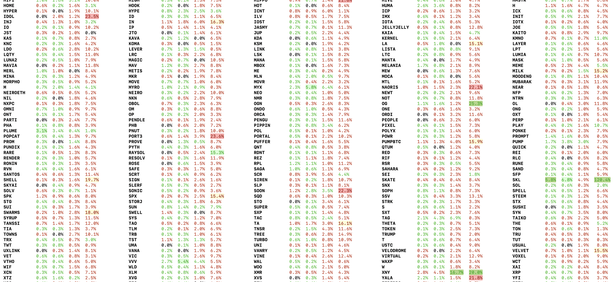

<h2>Crypto volatility scanner </h2>
scans through the list of assets (default: all the binance perpetuals) price data, and shows the % movement in various intervals (default: 1h, 2h, 4h, 48h), 
based on that user can find tradable assets for the near future, as traders need volatility for the short term trades.


## Installation 
python3 required
```
pip install -r requirements.txt
```

## Configure
1. scanner_config.json

   ```
   "columns": [
      {
        "name": "1h Change",
        "duration": 3600,
        "threshold": 5,
        "threshold2": 3
      },
      {
        "name": "2h Change",
        "duration": 7200,
        "threshold": 10,
        "threshold2": 5
      },
      {...}
   ```
   duration - in seconds
   threshold/threshold2 - it changes the background color of the cell when the volatility % value crosses that mark to highlight that asset

   ```
   "intervals": { 
      "data_refresh": 300,
      "display_refresh": 5 
    },
    "screen": {
        "table": 5
    },
   ```
   there are 2 threads running to refresh the data as it comes.
   
   data_refresh - <b>this is the interval timer for data pulling thread.</b> new data gets pulled after every 300 sec (5 min), assuming all the assets data will be finished pulling once by this time, if too many assets then this number can be 600 sec.

   display_refresh - <b>this is the interval timer for data refresh thread from cache (which gets filled by the above thread),</b> as data gets pulled we can start showing/updating the latest data as per the availability

   screen.table - number of columns to divide the list of assets, depending on the screen size this can be changed
   
2. assets.json - have list of assets
   ```
   "BTCUSDT",
   "BULLAUSDT",
   "CAKEUSDT",
   ```
currents it pulls data from only Binance exchange

``` python3 fetch_assets.py``` - running this will update/overwrite this assets.json file with the latest BINANCE perpetual assets

user can add/remove from the assets.json as per the requirement or screen size, by default Binance have too many assets now

## Running the app
```bash
python3 main.py
```

## Sample
this terminal background color is white on mac...



